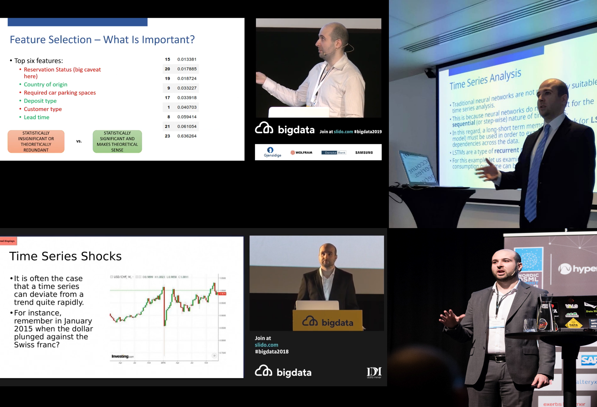

## Speaking Engagements

As part of my machine learning journey, I have also spoken at major data science conferences, including:

- Big Data Vilnius
- Nordic Data Science and Machine Learning Summit
- World Machine Learning Summit Dublin

Here are some presentation samples:

[Predicting Hotel Cancellations with Machine Learning: Classification and Time Series Analysis](https://www.youtube.com/watch?v=qQp8XsCSSIg)

[Working with Outliers and Time Series Shocks](https://www.youtube.com/watch?v=hi9ZNB-PRgU)
